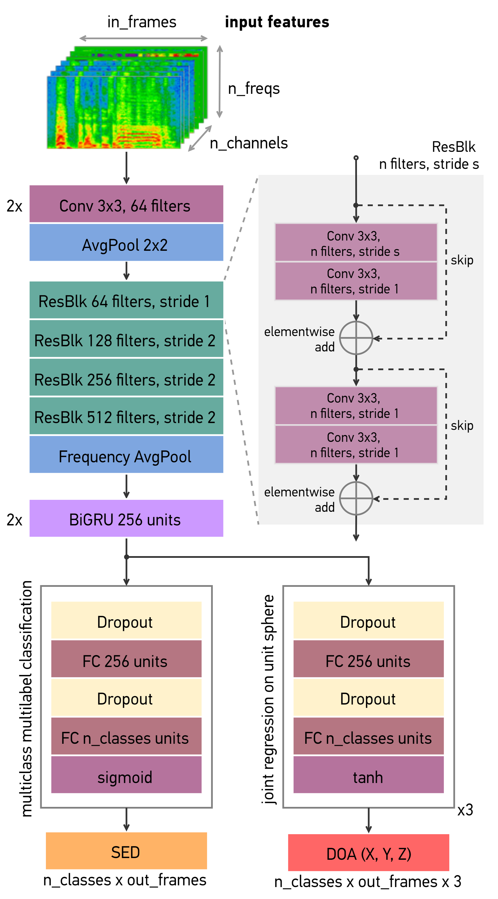

# SALSA-Lite: A Fast and Effective Feature for Polyphonic Sound Event Localization and Detection with Microphone Arrays

Official implementation for **SALSA-Lite** feature for polyphonic sound event localization and detection can be found in
the same repository for **SALSA** feature [here](https://github.com/thomeou/SALSA).

<pre>
SALSA-Lite: A Fast and Effective Feature for Polyphonic Sound Event Localization and Detection with Microphone Arrays
Thi Ngoc Tho Nguyen; Douglas L. Jones; Karn N. Watcharasupat; Huy Phan; Woon-Seng Gan. 
</pre>

[[**ArXiv paper**]](https://arxiv.org/abs/2111.08192)

## Introduction to sound event localization and detection
Sound event localization and detection (SELD) is an emerging research field that unifies the tasks of 
sound event detection (SED) and direction-of-arrival estimation (DOAE) by jointly recognizing the sound classes, 
and estimating the directions of arrival (DOA), the onsets, and the offsets of detected sound events.
While sound event detection mainly relies on time-frequency patterns to distinguish different sound classes,
direction-of-arrival estimation uses amplitude and/or phase differences between microphones to estimate source directions.
As a result, it is often difficult to jointly optimize these two subtasks.

## What is SALSA-Lite?

SALSA-Lite is a fast version of our previously proposed [SALSA](https://arxiv.org/abs/2110.00275) feature for polyphonic 
SELD. SALSA stands for Spatial Cue-Augmented Log-SpectrogrAm. The SALSA feature consists of multichannel log-linear 
spectrograms stacked along with the normalized principal eigenvector of the spatial covariance matrix at each 
corresponding time-frequency bin. In contrast to SALSA, which uses eigenvector-based spatial features, SALSA-Lite uses 
normalized inter-channel phase differences as spatial features, allowing a 30-fold speedup compared to the original 
SALSA feature. Both SALSA and SALSA-Lite features preserve the exact time-frequency mapping between the signal power and 
the source directional cues, which is crucial for resolving overlapping sound sources. 

SALSA-Lite is designated for multichannel microphone array (MIC) format, which is the most accessible and commonly-used 
type of microphone arrays in practice. Experimental results on the TAU-NIGENS Spatial Sound Events (TNSSE) 2021 dataset 
with directional interferences showed that SALSA-Lite features achieved similar performance as SALSA features for MIC 
format, and significantly outperformed multichannel log-mel spectrograms with generalized cross-correlation spectra 
(MelSpecGCC) feature. Specifically, SALSA-Lite improved  the F1 score and localization recall by 15% and 5%, 
respectively, compared to MelSpecGCC. 

<p align="center">
        
</p>

## Time complexity

SALSA-Lite is fast to compute. The average amount of time to compute SELD features for a 60-second audio clip with 4  
input channels, using a machine with a 10-core Intel i9-7900X CPU, is shown in following table. SALSA-Lite and
SALSA-IPD take only 0.30 s on average for fea-ture computation, 9 and 30 times faster than MELSPECGCC (2.90 s) and 
SALSA (9.45 s) respectively. Given the competitive performance and low computational load, SALSA-Lite is an attractive
candidate feature for real-time SELD applications for MIC format.

| Feature        | Average time (seconds)  | 
| :---        | :----:   |
| melspecgcc  | 2.90     | 
| SALSA       | 9.45     | 
| **SALSA-IPD** | 0.30   | 
| **SALSA-Lite**| 0.30   | 


## Effect of spatial aliasing on SELD performance

We report the performance of SALSA-Lite and SALSA-IPD with upper cutoff frequency for spatial components at 2kHz and
9kHz to examine the effect of spatial aliasing on SELD performance. For both features, 2kHz cutoff performed slightly 
better than 9kHz cutoff. However, the performance gaps are small. These results show that SALSA-Lite and SALSA-IPD 
are only mildly affected by spatial aliasing. 

<p align="center">
        
</p>

## Comparison with state-of-the-art SELD systems

We listed the performances of our model trained with the proposed SALSA-Lite features and other state-of-the-art SELD
system in the following table. Since there is a severe lack of SELD systems developed for MIC format, we also included 
SELD systems developed for first-order ambisonics (FOA) format. The model trained on SALSA-Lite feature significantly 
outperformed the DCASE baseline for MIC format. Even though our model is only a simple CRNN, it performed better than 
the highest-ranked ensemble from the 2021 DCASE Challenge in terms of error rate (ER) and F1 score (F), and only 
slightly worse in terms of localization error (LE) and localization recall (LR). The results show that the proposed 
SALSA-Lite features for MIC formats are effective for SELD. 

<p align="center">
        
</p>


## Network architecture

We use a convolutional recurrent neural network (CRNN) for our experiment. The network consists of a CNN that is 
based on ResNet22 for [audio tagging](https://github.com/qiuqiangkong/audioset_tagging_cnn), a two-layer BiGRU,
and fully connected (FC) layers. The network can be adapted for different input features by setting the number
of input channels in the first convolutional layer to that of the input features.

<p align="center">
        
</p>

## Prepare dataset and environment

Our code is tested on Ubuntu 18.04 with Python 3.7, CUDA 11.0 and Pytorch 1.7

1. Install the following dependencies by `pip install -r requirements.txt`. Or manually install these modules:
    * numpy
    * scipy
    * pandas
    * scikit-learn
    * h5py
    * librosa
    * tqdm
    * pytorch 1.7
    * pytorch-lightning      
    * tensorboardx
    * pyyaml
    * munch

2. Download TAU-NIGENS Spatial Sound Events 2021 dataset [here](https://zenodo.org/record/4844825). 
This code also works with TAU-NIGENS Spatial Sound Events 2020 dataset [here](https://zenodo.org/record/4064792). 

3. Extract everything into the same folder. 

4. Data file structure should look like this:

```
./
├── feature_extraction.py
├── ...
└── data/
    ├──foa_dev
    │   ├── fold1_room1_mix001.wav
    │   ├── fold1_room1_mix002.wav  
    │   └── ...
    ├──foa_eval
    ├──metadata_dev
    ├──metadata_eval (might not be available yet)
    ├──mic_dev
    └──mic_eval
```

For TAU-NIGENS Spatial Sound Events 2021 dataset, please move wav files from subfolders `dev_train`, `dev_val`, 
`dev_test` to outer folder `foa_dev` or `mic_dev`. 

## Feature extraction

Our code at main [SALSA repo](https://github.com/thomeou/SALSA) support the following features:  

| Name        | Format   | Component     | Number of channels |
| :---        | :----:   | :---          |  :----:            |
| melspeciv   | FOA      | multichannel log-mel spectrograms  + intensity vector    | 7 |
| linspeciv   | FOA      | multichannel log-linear spectrograms  + intensity vector    | 7 |
| melspecgcc  | MIC      | multichannel log-mel spectrograms  + GCC-PHAT    | 10 |
| linspecgcc  | MIC      | multichannel log-linear spectrograms  + GCC-PHAT   | 10 |
| SALSA       | FOA      | multichannel log-linear spectrograms  + eigenvector-based intensity vector (EIV)    | 7 |
| SALSA       | MIC      | multichannel log-linear spectrograms  + eigenvector-based phase vector (EPV)    | 7 |
| **SALSA-IPD** | MIC    | multichannel log-linear spectrograms  + interchannel phase difference (IPD) | 7 |
| **SALSA-Lite**| MIC    | multichannel log-linear spectrograms  + non-normalized interchannel phase difference (IPD) | 7 |

Note: the number of channels are calculated based on four-channel inputs.

To extract **SALSA-Lite** feature, edit directories for data and feature accordingly in `tnsse_2021_salsa_lite_feature_config.yml` in 
`dataset\configs\` folder. Then run `make salsa-lite`

## Training and inference

To train SELD model with SALSA-Lite feature, edit the *feature_root_dir* and *gt_meta_root_dir* in the experiment config 
`experiments\configs\seld_salsa_lite.yml`. Then run `make train`. 

To do inference, run `make inference`. To evaluate output, edit the `Makefile` accordingly and run `make evaluate`.

## Citation
Please consider citing our paper if you find this code useful for your research. Thank you!!!
```
@article{nguyen2021salsa_lite,
  title={SALSA-Lite: A Fast and Effective Feature for Polyphonic Sound Event Localization and Detection with Microphone Arrays},
  author={Nguyen, Thi Ngoc Tho and Jones, Douglas L and Watcharasupat, Karn N and Phan, Huy and Gan, Woon-Seng},
  journal={arXiv preprint arXiv:2111.08192},
  year={2021}
}
```
